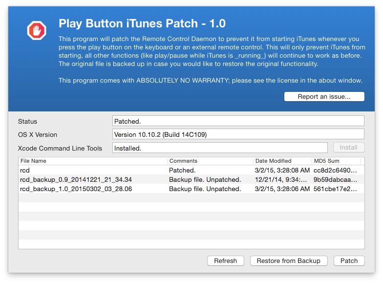

Play Button iTunes patch
========================

[Official Website](http://www.thebitguru.com/projects/iTunesPatch)

Overview
--------
This is a patch for removing the default OS X behavior of always starting iTunes when the play button on the keyboard is pressed. This feature can be useful for a lot of users, but it can also be annoying if you are using VLC, Nightingale or other similar programs that support the media keys.

The application will patch the Remote Control Daemon to prevent it from starting iTunes whenever you press the play button on the keyboard or an external remote control. This will only prevent iTunes from starting, all other functions (like play/pause while iTunes is running) will continue to work as before. The original file is backed up in case you would like to restore the original functionality.

OS X El Capitan Compatibility
--------

This patch works by modifying a system file (rcd). With the new System Integrity Protection (SIP) functionality introduced in El Capitan you have to take additional steps to temporarily disable SIP. Hopefully I will get some time soon to update the binary to guide the user through this, but for now please follow the instructions documented on the [project page](http://www.thebitguru.com/projects/iTunesPatch).

General Information
-------------------
Author: Farhan Ahmad (<http://www.thebitguru.com/projects/iTunesPatch>)
